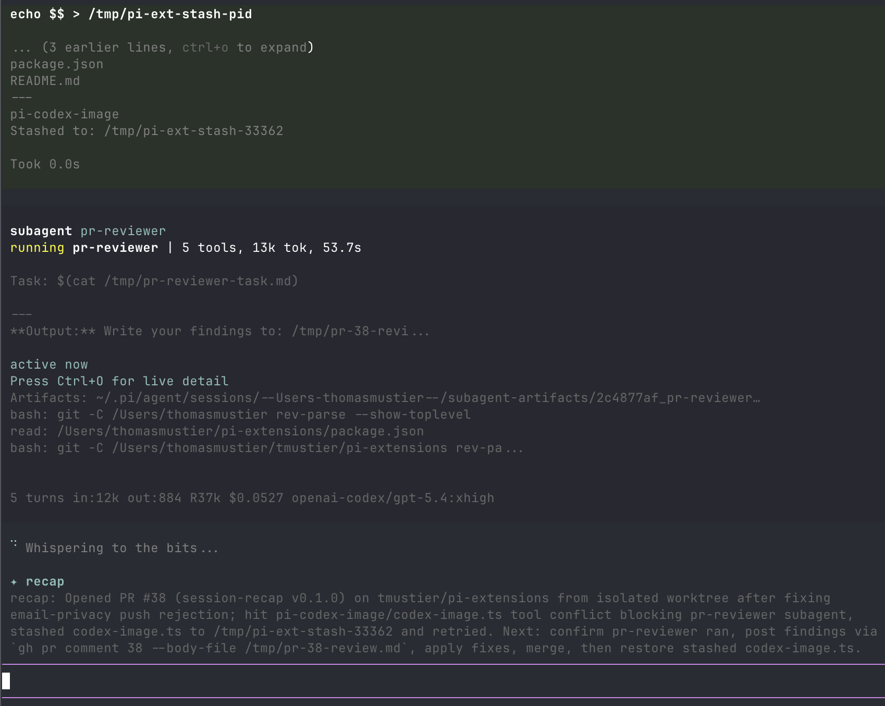

# session-recap

Standalone fork of
[Thomas Mustier's session-recap](https://github.com/tmustier/pi-extensions/tree/main/session-recap),
published as `@jetserge/pi-session-recap`.

Based on upstream version 0.5.0, with the fixes from
[PR #106](https://github.com/tmustier/pi-extensions/pull/106) at commit
`0c9b116`. Incomplete responses are discarded, and request failures use Pi
notifications instead of writing over the terminal. The extension source and
regression tests are preserved from that commit.

"While you were away" recap for Pi, modelled on Claude Code's away-summary. When
you've genuinely been away from a Pi session, a short recap is drafted while
you're gone and parked at the end of the scrollable transcript so it's waiting
when you return. In Pi's regular TUI it stays above the editor.



Built for multi-clauding / multi-pi workflows where several agent sessions run
in parallel tabs.

The recap orients rather than reports: it states the high-level task first (what
you're building or debugging), then the concrete next step — the last assistant
message is already on screen; what you've lost after a context switch is the
task thread.

## How it triggers

1. **Away timer.** The extension enables terminal focus reporting (DECSET
   `?1004`) on session start. After the terminal has been continuously blurred
   for `--recap-away-seconds` (default 90s), a recap is generated and shown, so
   it's parked above the editor when you refocus.
2. **Turn ends while you're away.** If the agent finishes a turn while the
   terminal is blurred — the prime multi-tab moment — a recap is drafted after a
   short debounce.
3. **Idle fallback.** Only on terminals that haven't demonstrated
   focus-reporting support: `--recap-idle-seconds` (default 120s) after the last
   `turn_end` with no input, a recap is generated anyway. The first real focus
   event disarms this path for the session.

Also fires automatically on `/resume` and `/fork` so you know where the prior
session left off.

The recap disappears when you submit a message or new agent work begins. It is
temporary UI: it is not saved in session history or sent to the model.

Quick alt-tabs cost nothing: no model call is made until you've actually been
away for the full threshold. If you return while a recap is still drafting, it's
allowed to finish — it lands moments after you're back, which is exactly when it
helps.

## Terminal compatibility

| Terminal                                          | Focus reporting  | Notes                                                                                 |
| ------------------------------------------------- | ---------------- | ------------------------------------------------------------------------------------- |
| iTerm2, Ghostty, Alacritty, Kitty, WezTerm, xterm | ✅               | Works out of the box.                                                                 |
| VS Code integrated terminal, Warp                 | ✅               | Works.                                                                                |
| Apple Terminal                                    | ⚠️ Partial       | Idle fallback covers it.                                                              |
| tmux                                              | ✅ (with config) | Add `set -g focus-events on` to `~/.tmux.conf`, then `tmux source-file ~/.tmux.conf`. |

If focus events cause any weirdness in your terminal, run with
`--recap-disable-focus` and the idle fallback still works.

## Model

The recap reuses the active provider's authentication and chooses a cheaper
model when available:

1. `--recap-model` when set.
2. `anthropic/claude-haiku-4-5` for Anthropic sessions.
3. GPT-5.6 Luna when the active model is GPT and its provider offers Luna.
4. The currently active model otherwise.

The recap sends no system prompt, no tools and no Agent Skills, and never writes
to the prompt cache. Reasoning is always off: most APIs disable thinking when no
reasoning level is requested, and Codex models are sent an explicit
`reasoningEffort: "none"` because they would otherwise fall back to the
server-side default.

It uses a 30-message window in native roles, plus the initial request and latest
compaction or branch summary. Large initial requests and tool results retain
their beginning and end.

Custom providers work when they use a built-in pi-ai API type. Pi-only custom
handlers are skipped because the standalone compatibility layer cannot route
them; use `--recap-model "<provider>/<id>"` to select a supported model.

## Install

Requires Node.js 22.18 or newer and Pi with the `@earendil-works` APIs.

```bash
pi install npm:@jetserge/pi-session-recap
```

If you use `@tmustier/pi-session-recap`, remove it before you install this fork:

```bash
pi remove npm:@tmustier/pi-session-recap
pi install npm:@jetserge/pi-session-recap
```

If you use the upstream monorepo, exclude `session-recap/index.ts` from that
package's extension filter. Do not load both versions.

For a local checkout, run `npm ci` in this repository, then run `pi install .`.

## Flags

| Flag                       | Default   | Description                                                                                          |
| -------------------------- | --------- | ---------------------------------------------------------------------------------------------------- |
| `--recap-away-seconds <n>` | `90`      | Seconds of continuous terminal blur before an away recap is generated.                               |
| `--recap-idle-seconds <n>` | `120`     | Idle-fallback delay after `turn_end`, used only when the terminal doesn't report focus.              |
| `--recap-disable-focus`    | `false`   | Disable DECSET `?1004` focus reporting. Idle fallback still runs.                                    |
| `--recap-during-active`    | `false`   | Allow away recaps while an agent turn is still running, instead of deferring to the end of the turn. |
| `--recap-disable`          | `false`   | Disable the automatic recap entirely. `/recap` still works.                                          |
| `--recap-model "<p/id>"`   | automatic | Override model selection, e.g. `anthropic/claude-sonnet-4-6`.                                        |

## Command

| Command  | Description                                                    |
| -------- | -------------------------------------------------------------- |
| `/recap` | Force-generate a recap right now, bypassing the activity gate. |

## Development and releases

```bash
npm ci
npm run typecheck
npm test
npm run verify:tarball
```

The tarball check runs all regression tests against the packed extension.
`npm publish` runs these checks through `prepublishOnly`.

The first npm version requires an interactive publish from this repository:

```bash
npm login
npm publish --access public
```

After the package exists, configure its npm trusted publisher for GitHub
Actions:

- Owner: `CrazyCoder`
- Repository: `pi-session-recap`
- Workflow: `publish.yml`

Leave the environment field empty. No npm token is needed in GitHub secrets.

The workflow supports a manual dry run. For subsequent releases, update the
package version and changelog, commit to `main`, then push a matching
`v<version>` tag. The workflow checks the tag and branch, runs verification, and
publishes through OIDC. A version already on npm is skipped, so the bootstrap
tag can be pushed after the manual publish.

Retain the upstream MIT attribution when you distribute this fork.

## License

MIT
